# Installation Types (Standard vs Customized)

## Standard Installation
The standard installation assumes you would like to take the SharePoint package file located in our GitHub repository and install using the configuration outlined in this readme file (assets are created under a SharePoint site
called PVSS as well as the list names and all related PVSS terms within the application)

Continuing below steps you can take the ***pvss.sppkg*** file from the ***"sharepoint/solution"*** folder on the GitHub repo <a href="https://github.com/OfficeDev/microsoft-teams-partner-voice-site-survey">here</a> (or use the one customized for your organization if someone provided a customized file)

### Prerequisites
Ensure the administrator who will install the app has access to following:

- SharePoint or Tenant Administrator role
- Permission to upload application package into SharePoint Online
- Ability to create a site in SharePoint Online
- PartnerVoiceSiteSurvey project in GitHub

Once the package has been deployed, and solution synced to Teams, the same admin will likely also be asked to complete the first run experience. This first run creates the SharePoint site (PVSS) that all assets of this solution will be created under. ***Additionally permissions need to be modified by an owner of this site to include edit/contribute rights for the organizations ability to interact with the solution.***

### Deploy your Package to SharePoint
<br/>
<b>IMPORTANT NOTE:</b> If you have just created a new tenant please wait for around 15 minutes before starting with the below steps.

<br/>
1.	Open SharePoint and sign in using the administrator account. Click on the "App Launcher" (waffle icon) in the top left corner of the banner.
<br/>

 
<br/>
2.	Select Admin from the menu that appears.
<br/>

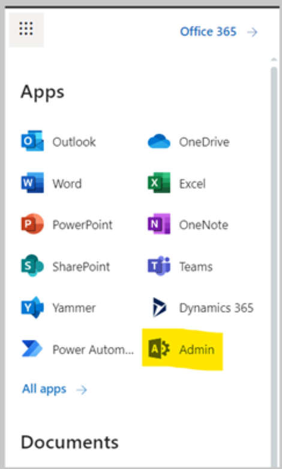 
<br/>
3.	Select SharePoint from the menu that appears. You may need to click "... Show all" for the SharePoint entry to appear.
<br/>

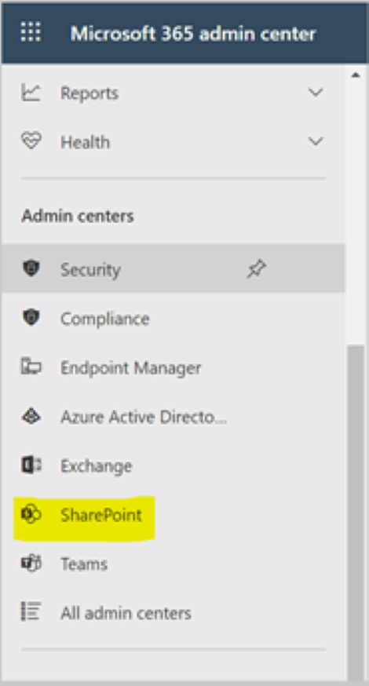 
<br/>
4.	You will be directed to the SharePoint admin center.
<br/>

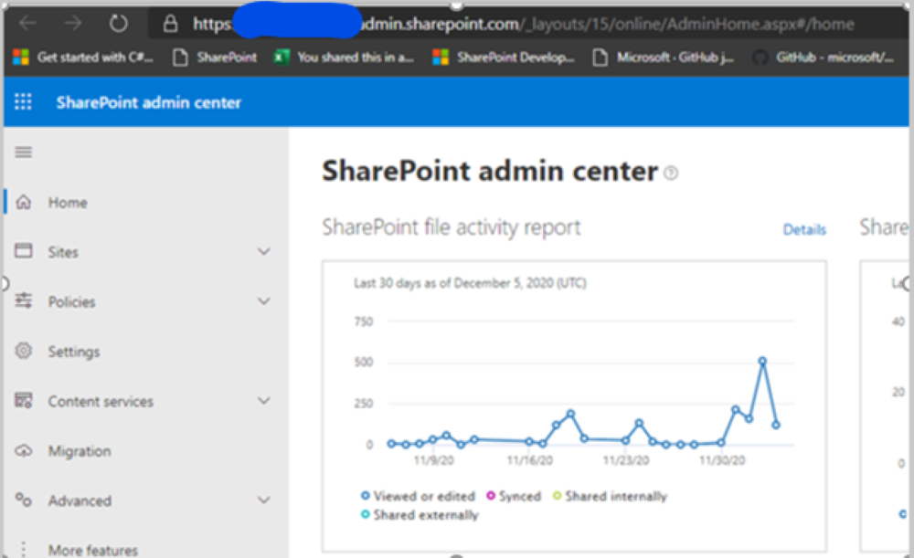 
<br/>
5.	Click on "More features" menu item. Locate the "Apps" section and click the ***Open*** button.
<br/>

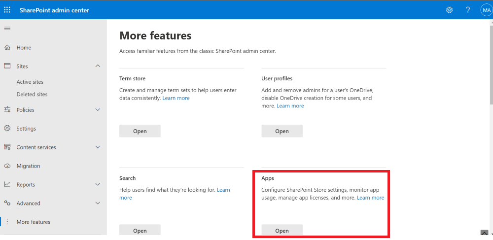
<br/> 
6.	Click the ***App Catalog*** link.
<br/>

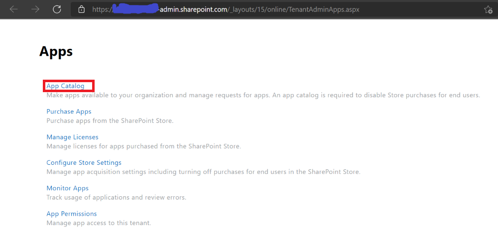 
<br/>
*If you do not see an app catalog available, use the instructions <a href='https://docs.microsoft.com/en-us/sharepoint/use-app-catalog#step-1-create-the-app-catalog-site-collection' target="_blank">here</a> to create a new app catalog before continuing.*
<br/>
7.	Click the ***Distribute apps for SharePoint*** link.
<br/>

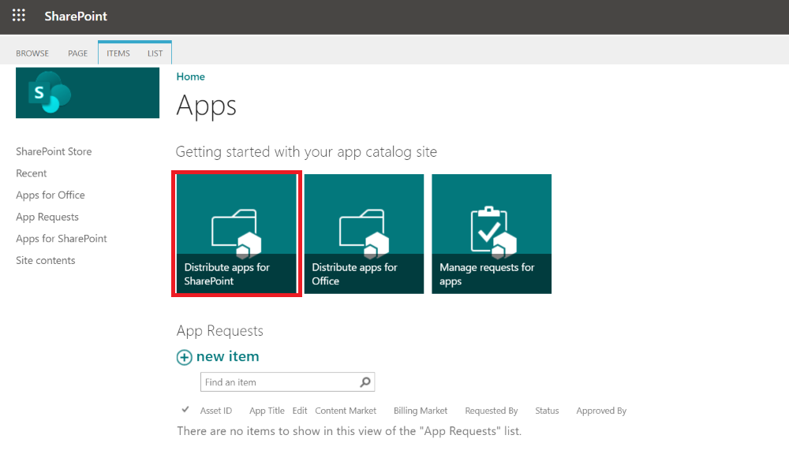 
<br/>
8.	Click the ***New*** menu item
<br/>

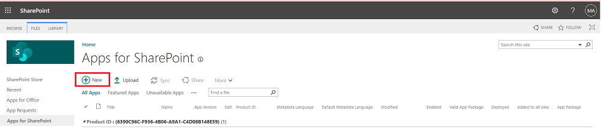 
<br/>
9.	Click the ***Choose Files*** button, select the ***pvss.sppkg*** file you downloaded or created earlier, and click on ***OK***
<br/>

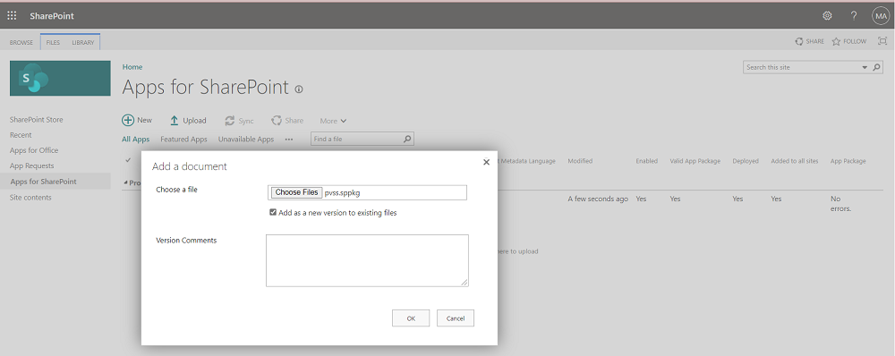 
<br/>
10.	A confirmation dialog is displayed. Ensure the checkbox for "Make this solution available to all sites in the organization" is chosen and click ***Deploy***.
<br/>

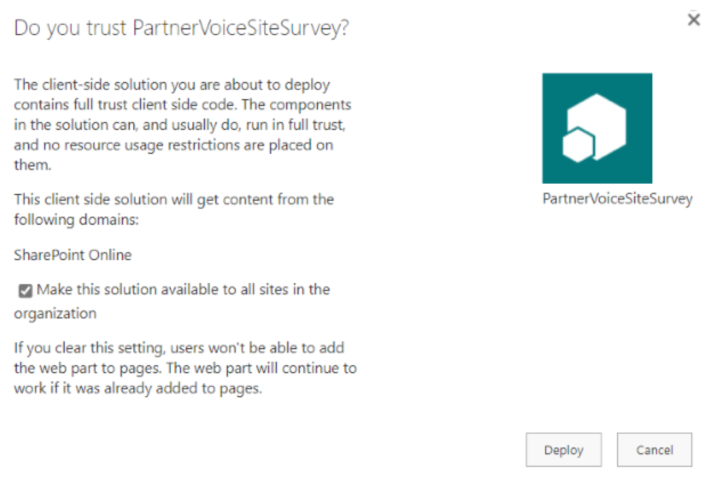 
<br/>
11.	Wait until the solution is deployed successfully without errors.
<br/>

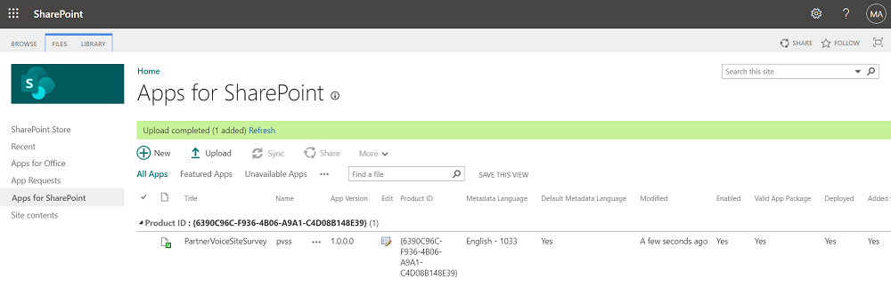 
<br/>
12.	Return to app list in the App Catalog and select the ***pvss*** app. Select the Files tab in the ribbon and click on ***Sync to Teams*** button.
<br/>
  
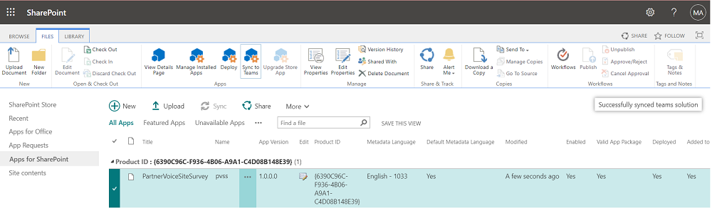 
<br/>

## Customized Installation
The customized installation makes the assumption you wish to change the default variables (site location, text or visual aspects, etc) with the Partner Voice Site Survey. Customizing the installation takes it outside of 
configurations we have tested against but allows you to modify any aspect of the platform. Below are high level steps to get you started on a customized installation.

### Set up your SharePoint Framework development environment
Follow this article to setup the SPFX dev environment - https://docs.microsoft.com/en-us/sharepoint/dev/spfx/set-up-your-development-environment 

***Important:*** The version 14.18.2 is the currently recommended version of Node.js to use with the SharePoint Framework. To download specific versions of Node.js versions, use the <a href="https://nodejs.org/en/download/releases/">Node.js > Downloads > Previous Releases</a> page.


### Customize configuration

If desired the administrator can configure the installation location for the site and update the master data in the lists using following steps:

1.  Download the <a href="https://github.com/OfficeDev/microsoft-teams-partner-voice-site-survey">PVSS</a> project from GitHub

2.	Update the ***"src/webparts/home/provisioning/provisioningAssets.json"*** configuration file. Changing the values in the JSON file will customize the site name or list data when it is created during deployment.
 <br/>

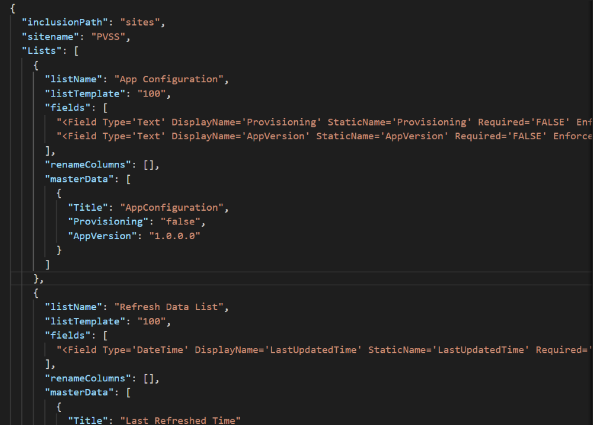     

```
· inclusionPath (SharePoint inclusion path - e.g. sites or teams)

· sitename (SharePoint site name)

· masterData (Items to be added in SharePoint list)
```
<br/>

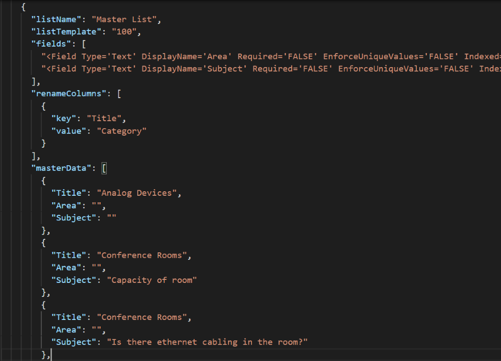 
<br/>

3.	Create the SharePoint App Package. This package will be used to deploy the application in SharePoint and Microsoft Teams. To create a production package, run the below commands :

```
· npm install 

· gulp build

· gulp bundle --ship

· gulp package-solution --ship
```

4.	Navigate to the solution folder where you cloned and locate the newly created ***pvss.sppkg*** package in ***"sharepoint/solution"*** and deploy it in the App Catalog site in SharePoint.


## First Run Experience: Add ***Partner Voice Site Survey*** Tab in Teams

1.	Navigate to Microsoft teams, select the Team and channel where you want to install Partner Voice Site Survey. Click ***Add a tab***, choose ***Partner Voice Site Survey*** from the app list (Search for Partner), click on Add and then Save.

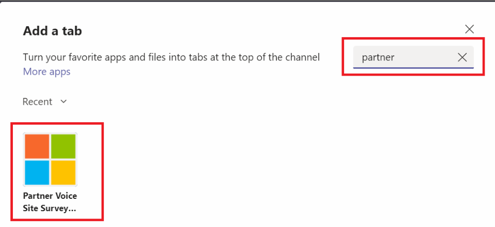 
<br/>

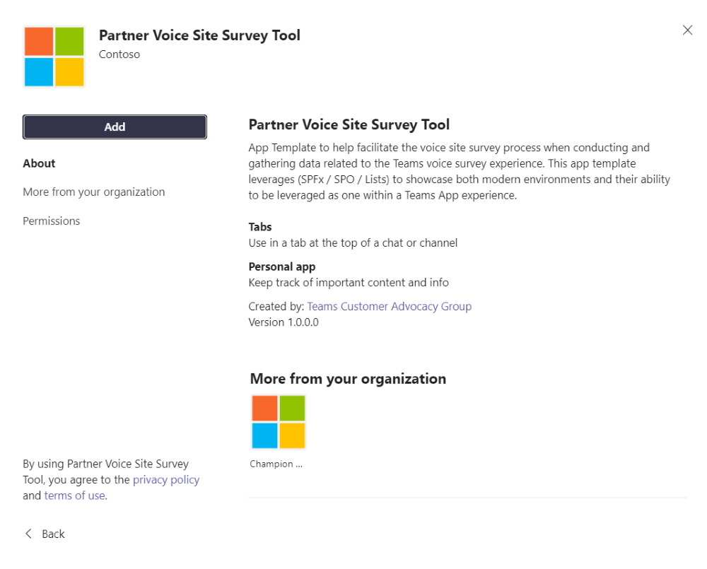

Alternately you can also add the Partner Voice Site Survey as a personal app in the left side rail by selecting the “...” and searching for Partner Voice Site Survey, and then selecting add. 

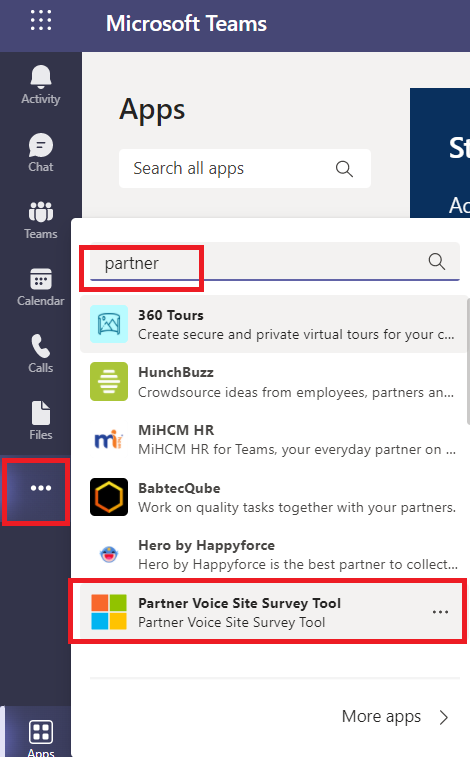 

This first run experience needs to be completed by the person who will be an admin of the platform, as it is this experience that creates the initial resources (SPO site + assets (lists mentioned in the provisioning json file). This user that completes the first run is added as a owner of the site. Alternately you may need a SharePoint admin to run the first run so the site is created and then have them add you as a owner of the sites once the assets have been created. 

<br/>

2. After clicking on 'Add', the app will be loaded in the teams and you will see a button to setup the App. Click on the Setup PVSS App button and set up may take around 1-2 minutes.
<br/>

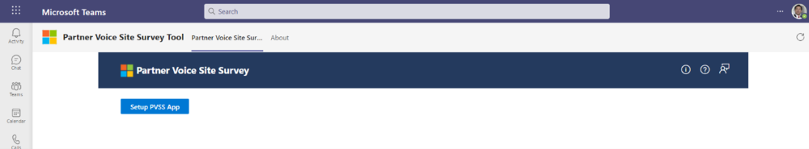
</br>

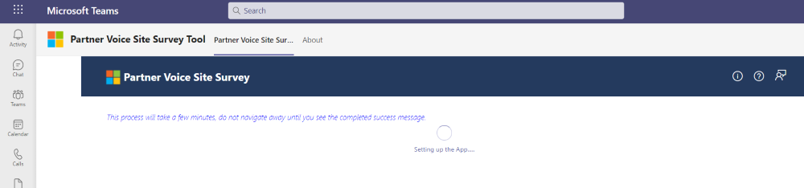

3. After the set up is complete, the success message is shown as below. 
<br/>

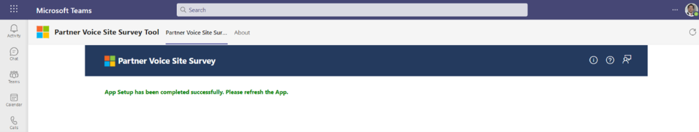

4. On refeshing the app, the landing page is displayed. 
<br/>

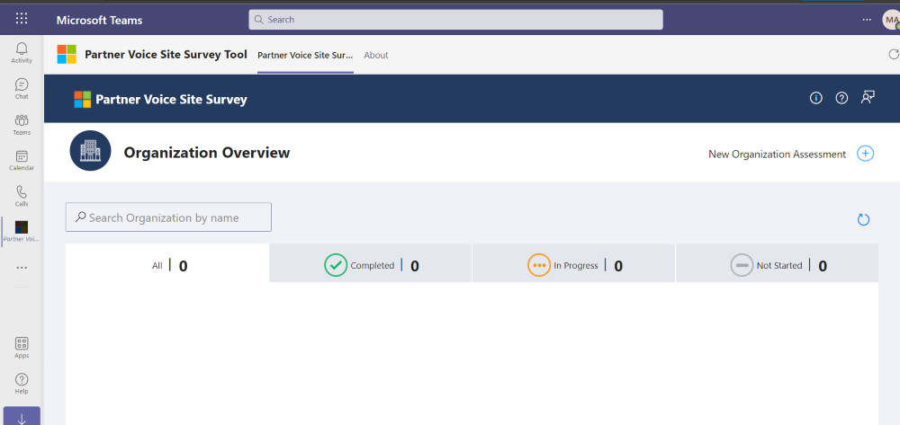
<br/>

5. If you see an error message, try clicking on Setup PVSS App button again. If you see the landing page shown in the above picture the app set up is complete.<br />
If you still do not see the landing page after refresh please create an issue in the Github.
<br/>

6. Grant Permissions to users:

· Navigate to the URL for the PVSS site as the administrator. 

· If you are using the default configuration, this can be found at ***`https://<yourtenant>.sharepoint.com/sites/PVSS/`***.

- Select site permissions
- Advanced permissions settings
- Select Grant permissions  
- Enter the users you would like to have permission to modify and access information from the PVSS app<br/>
- Select Members group with Edit access in the Permission level<br/>
- Unselect send email<br/>
- Press share<br/>

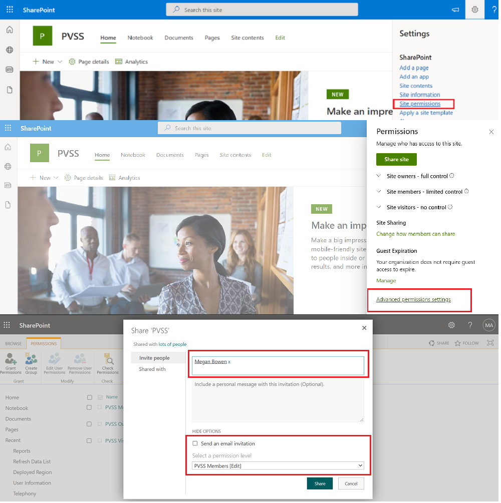 
<br/>

### Completed Install
Once you have performed the above steps, the deployment of the Partner Voice Site Survey is now complete.