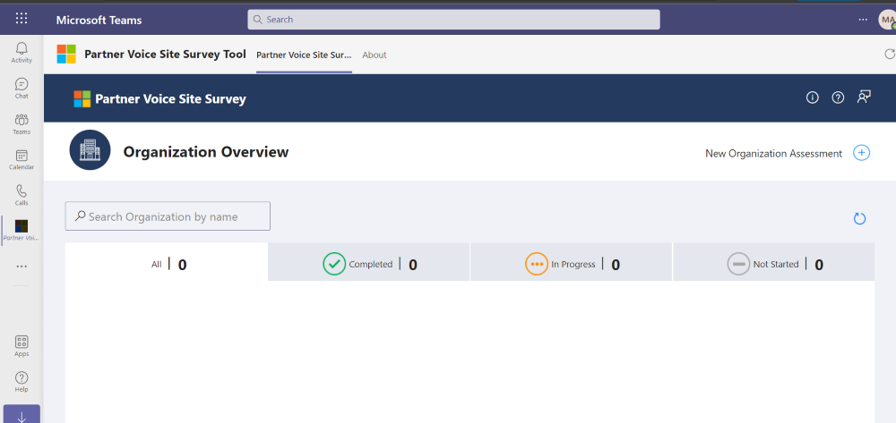
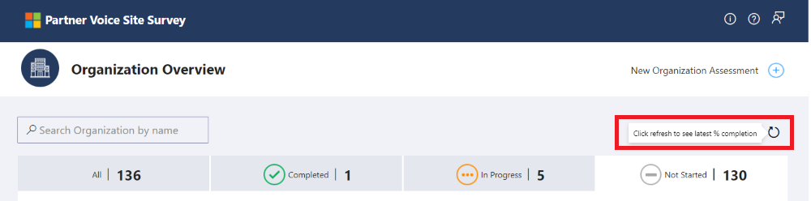
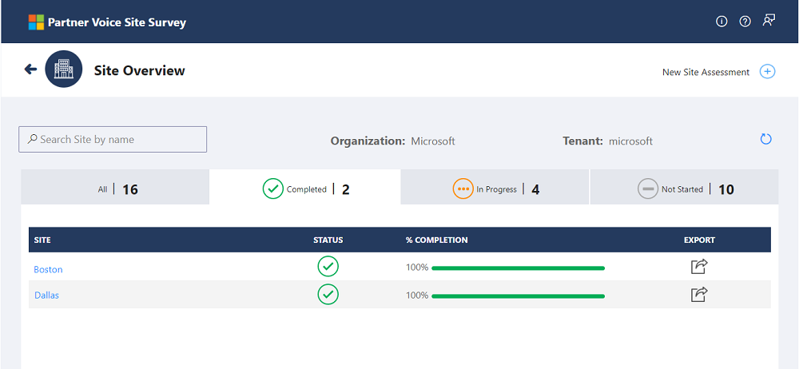
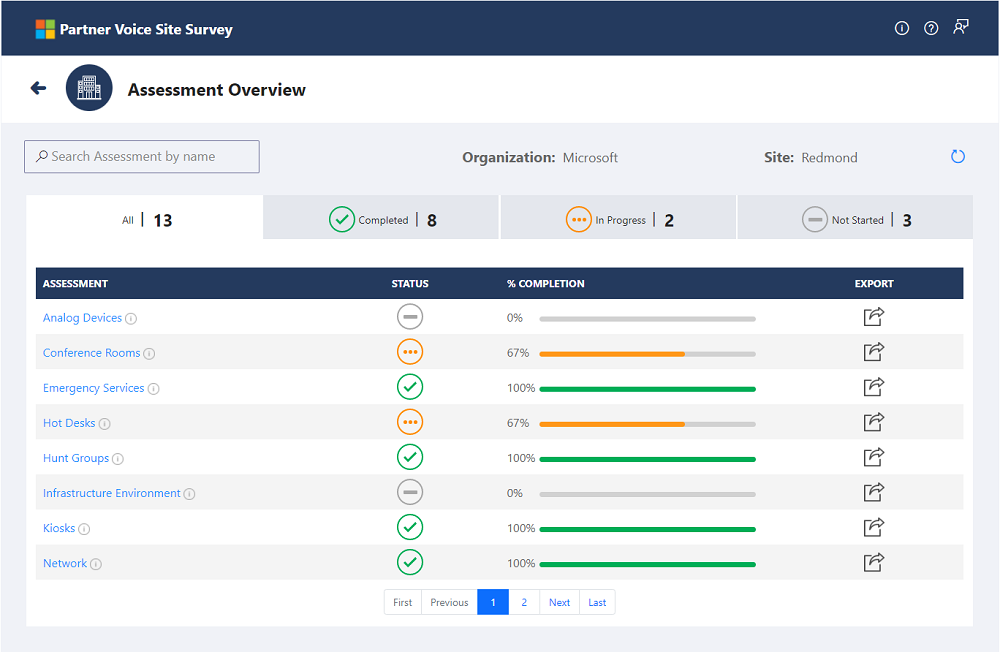
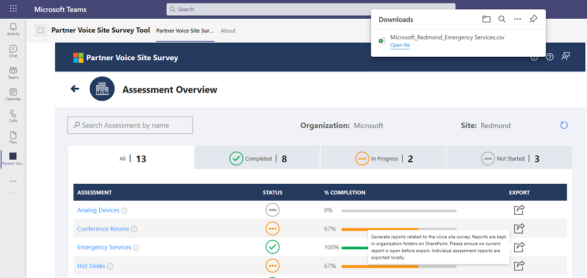

## Overview

1.  The current version of the Partner Voice Site Survey operates as an app in Microsoft Teams that is installed locally in your tenant by your tenant administrator or any user who has the capability to side load the application.
2.  Once installed, it can be accessed via “+Add a tab”  option at the top of the channel within a team. ***Channel > Add a tab > Partner Voice Site Survey *** or from accessing the platform as a personal app on the left rail by ***Selecting "..." for more apps in left rail of Teams > searching for Partner Voice Site Survey > select Add (adds as personal app)***
3.	The admin can setup the app by clicking “Setup PVSS App” button and it will create a SharePoint site named “PVSS” and lists provided in the provisioning JSON file. A local administrator is responsible for maintaining the SharePoint lists. This person can be the individual who manages the PVSS program for the organization or his/her delegate.
4.	This app will enable the partner to complete the site survey across all the sites involved without having to have a SME at each site.
5.	There are 5 major components in Partner Voice Site Survey App.
> *	Organization Overview
> *	New Organization Assessment
> *	Site Overview
> *	New Site Assessment
> *	Assessment Overview
  

 

## Organization Overview

Organization Overview is the landing page where user can view the different organizations for which assessments need to be taken. It also has a link to create new organization assessment. The screen shows the status of the assessment for each organization with the % completion. User can navigate between tabs to view the organizations based on status. This screen also allows user to search for any organization using the search option. On click of any organization, user will be redirected to site overview screen. This screen also has Export functionality, which allows user to export the site details by clicking the Export button.

      

### New Organization Assessment 
New Organization Assessment screen will capture the Organization Name, Tenant Name, Tenant Id and Deployed Region to create a new organization for taking up the assessment. Once the user enters all these information, the user can save the details by clicking the ‘Save’ button.

#### Input validations
The input text fields in the New Organization Assessment will allow only alphanumeric characters and the following special characters .,-, _, &, @. User will see the below error on entering any other special characters in any of the fields (Organization Name, Tenant Name, Tenant ID).

 
 

After clicking the Save button, the organization will be created. User can see the organization created in the organization overview screen like below:

     
     
### Search for Organization
To search for any organization, user can enter the name in the search box and get refined results.

  

Search results will be displayed like the screenshot below for the entered keyword in the search box.
 
  

### Refresh button
User should click on the refresh button to see the recent status of completion for all organizations.  

 

### Organization Dashboard

#### All Tab
User can view all the records.  

 

#### Completed Tab
User can view all the organizations that are in ***Completed*** status. 

 

#### In Progress Tab
User can view all the organizations that are in ***In Progress*** status. 

 

#### Not Started Tab
User can view all the organizations that are in ***Not Started*** status. 

 

#### Export
When a user clicks on export icon for any of the organization, it will export the assessment details for all it's sites into an excel file and upload it to the organization folder in SharePoint library.
 

##### Export Tooltip

 
 

##### Organization Report Screen

 
 

##### Export Error

In case of any error occurs during export, it will be displayed in the popup screen.

 
 

#### Pagination
Page navigation bar will be available for navigation when the list has more than 8 records. First, Previous, Next and Last options are also available for navigation.

 

### Edit Organization details in SharePoint list
Go to PVSS SharePoint site --> Organization Overview list
Click on the Ellipsis button for the Organization to edit --> Click on Edit option

 

User will see a screen like below to edit and save the changes into SharePoint list.

 

## Site Overview
Site Overview screen contains the list of sites for the selected organization. It also contains the link to create new site assessment. This screen shows the status of the assessment for each site with the % completion. User can navigate between tabs to view the site list based on status. This screen also allows user to search for any site using the search option. On click of any site, user will be redirected to assessment overview screen. This screen has Export functionality, that allows user to export Assessment Data by clicking the Export button.

 

### New Site Assessment
New Site Assessment popup allows user to create new sites to take up an assessment. User must enter the site name and save it by clicking the ‘Save’ button.

 

After clicking the Save button, the site and the assessments will be created and the user will see a success message like below.

#### Input validations 
User can only enter alphanumeric and any of the following special characters .,-, _, &, @ in the Site Name field. User will see the error below on entering any other special characters.

 

### Search for Site
User can enter the site name in the search box to see the refined results.

 

### Refresh Icon
User should click on the refresh icon to see the recent status of completion for all sites.

 

### Site Dashboard

#### All Tab
User can view all the sites for the selected organization. 

 

#### Completed Tab
User can view all the sites that are in ***Completed*** status. 

 

#### In Progress Tab
User can view all the sites that are in ***In Progress*** status. 

 

#### Not Started Tab
User can view all the sites that are in ***Not Started*** status. 

 

#### Export
User can click on the export icon to export all the Assessment details for that site into an excel file and it will be uploaded to it's organization folder in SharePoint library.

##### Export Tooltip

 
 

##### Site Report Screen

 
 

 
 

##### Export Error

In case of any error occurs during export, it will be displayed in the popup screen.

 
 

#### Pagination 
Page navigation bar will be available for navigation when the list has more than 8 records. First, Previous, Next and Last options are also available for navigation.

 

### Edit Site details in SharePoint list
Go to PVSS SharePoint site --> Site Overview list 

 

Click on the Ellipsis button for the Site to edit --> Click on Edit option 

 

User will see the screen like below to edit the details and save it to SharePoint. 

 

## Assessment Overview
Assessment Overview screen contains the list of assessments for the selected site of any organization. The screen shows the status of the assessments with the % completion. User can navigate between tabs to view the assessments based on the status. This screen also allows user to search for any assessment using the search option. On click of any assessment, user will be redirected to the filtered view in the SharePoint list to take up an assessment. This screen has Export functionality, that allows user to export Assessment details.

 

### Search for Assessment
To search for any assessment, user can enter the name in the search box and get refined results.

 

### Refresh Icon
User should click on the refresh button to see the recent status of % completion for all assessments.

 

### Assessments Dashboard

#### All Tab
User can view all the assessments for a site. 

 

#### Completed Tab
User can view only the assessments that are in ***Completed*** Status. 

 

#### In Progress Tab
User can view only the assessments that are in ***In Progress*** Status. 

 

#### Not Started Tab
User can view only the assessments that are in ***Not Started*** Status. 

 

#### Information Icon
The info icon will display the details about the column that is used to calculate the percentage completion for each assessment.

 

#### Export 
When user clicks export icon  in any of the Assessment record system will export all the Assessment record into CSV file for that Assessment and file will be auto downloaded.

 

#### Pagination
Page navigation bar will be available for navigation when the list has more than 8 records. First, Previous, Next and Last options are also available for navigation.

 

### Edit the Assessment
User can click on any assessment name to take up the assessment for the site and will see the filtered view in the SharePoint list like below. User can edit the items in the list to complete the assessment. 

 

User can also edit the assessments in the SharePoint list by following the steps below. 
i.	Go to PVSS SharePoint site --> Site contents 

 

ii.	Select a list (Analog Devices, Conference Rooms, Emergency Services, Hot Desks, Hunt Groups, Infrastructure Environment, Kiosks, Network, Reception, Site Overview Assessment, Site Services, Telephony, User Information) to take up the assessment.  

 

iii. Edit the items in the selected list and save it. 

